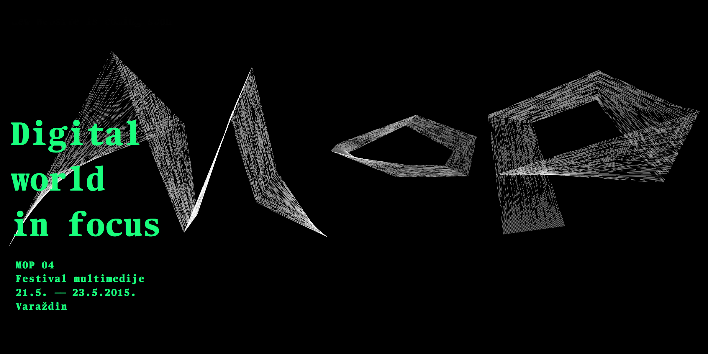

# Mop 2015 - [mop-fest.com](http://mop-fest.com)

MOP 4 is a student-organized event based on multimedia and entrepreneurship, taking place on University North in Varaždin.

In this repository you can find the whole website of this project
Please refer to `gulpfile` for the list of available tasks!

## Instalation guide
* clone the repositorie `https://github.com/dinodsaurus/MOP2015`
* Install all the dependencies `npm install && bower install`
* To start the server `gulp serve`
* To make production ready code `gulp`
